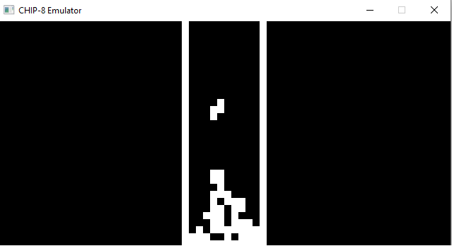
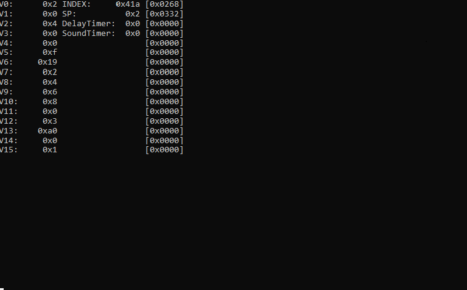

#CHIP-8
I made this project because I was interested in the process of creating emulators. The console also displays the status of the program (values of registers, index, etc.)
[CHIP-8](https://en.wikipedia.org/wiki/CHIP-8)



##Сonditions
- SDL2 graphics library
- C++20 standart
##Controls
```
     CHIP8       KEYBOARD
    0 1 2 3      X 1 2 3
    4 5 6 7 ===> Q W E A   
    8 9 A B ===> S D Z C
    C D E F      4 R F V
```
##Games
There are no games in this project, but they can be found at this link:
https://github.com/dmatlack/chip8/tree/master/roms/games
##Additional information
When creating this project, I used these sources:
- http://devernay.free.fr/hacks/chip8/C8TECH10.HTM
- https://austinmorlan.com/posts/chip8_emulator/